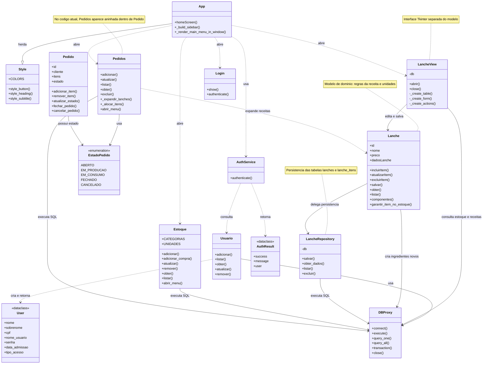

# Diagrama de classes atual

Este diagrama representa a estrutura atual do projeto SnackFlow, incluindo as principais classes e suas dependencias.

## Organizacao atual

- `Lanche` representa o modelo e as regras da receita.
- `LancheRepository` concentra o acesso as tabelas `lanches` e `lanche_itens`.
- `LancheView` concentra a interface Tkinter do cadastro de lanches.
- `DBProxy` centraliza a conexao e a execucao de comandos SQLite.
- `Estoque` controla os itens e suas compras.
- `Pedidos` transforma uma receita em itens do estoque antes de realizar a baixa.
- `App` coordena a navegacao e herda os estilos visuais de `Style`.

## Observacao importante

O arquivo `Pedidos.py` atualmente declara a classe `Pedidos` dentro da classe `Pedido`. O diagrama mostra as duas classes separadamente para facilitar a leitura, mas registra essa diferenca na anotacao. Essa estrutura pode ser corrigida em uma etapa futura de refatoracao.
