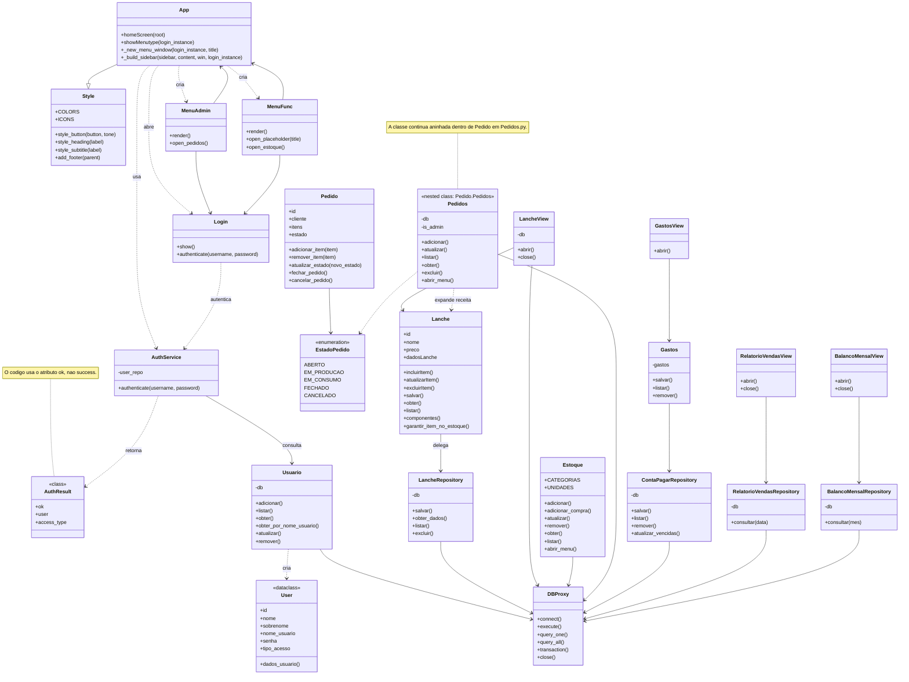

# Diagrama de classes atual

Este diagrama representa as classes existentes no codigo do SnackFlow. As classes de interface usam Tkinter; as classes de persistencia acessam o SQLite por meio de `DBProxy`.

## Organizacao atual

- `App`, `Login`, `MenuAdmin`, `MenuFunc` e as classes `*View` formam a camada de interface Tkinter.
- `Lanche`, `Estoque`, `Pedido`, `Pedidos`, `Gastos` e `Usuario` concentram regras e operacoes do dominio.
- `LancheRepository`, `ContaPagarRepository`, `RelatorioVendasRepository` e `BalancoMensalRepository` organizam consultas e persistencia.
- `DBProxy` centraliza a conexao e a execucao de comandos SQLite.
- `AuthService` autentica contas padrao e usuarios persistidos, retornando `AuthResult`.

## Observacao

O arquivo `Pedidos.py` declara `Pedidos` dentro de `Pedido`. O diagrama exibe a classe aninhada separadamente para facilitar a leitura, mas registra a relacao com a anotacao `nested class: Pedido.Pedidos`.
