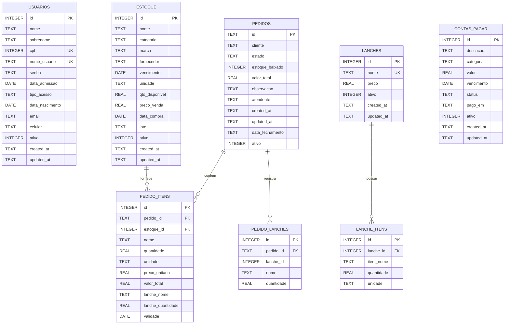

# Modelagem atual do SysDB

Documento baseado na estrutura existente em `data/SysDB.db` e nas tabelas criadas pelas classes do projeto.

- Banco: SQLite
- Arquivo: `data/SysDB.db`
- Tabelas da aplicacao: 8
- Tabela interna do SQLite: `sqlite_sequence`
- Data da consulta: 2026-09-15

## Diagrama entidade-relacionamento

## Dicionario de dados

### `usuarios`

Cadastro de usuarios do sistema. A autenticacao consulta `nome_usuario` e valida `senha` usando hash.

| Coluna | Tipo | Chave/Regra | Descricao |
|---|---|---|---|
| `id` | INTEGER | PK, autoincremento | Identificador do usuario |
| `nome` | TEXT | NOT NULL | Nome |
| `sobrenome` | TEXT | NOT NULL | Sobrenome |
| `cpf` | INTEGER | UNIQUE, NOT NULL | Documento do usuario |
| `nome_usuario` | TEXT | UNIQUE, NOT NULL | Login |
| `senha` | TEXT | NOT NULL | Senha armazenada com hash |
| `data_admissao` | DATE | | Data de admissao |
| `tipo_acesso` | TEXT | | Tipo de acesso, como `admin` ou `atend` |
| `data_nascimento` | DATE | | Data de nascimento |
| `email` | TEXT | | Email |
| `celular` | TEXT | | Telefone celular |
| `ativo` | INTEGER | NOT NULL, padrao 1 | Exclusao logica |
| `created_at` | TEXT | NOT NULL | Data de criacao |
| `updated_at` | TEXT | | Data da ultima alteracao |

### `estoque`

Itens disponiveis para uso nos lanches e pedidos.

| Coluna | Tipo | Chave/Regra | Descricao |
|---|---|---|---|
| `id` | INTEGER | PK, autoincremento | Identificador do item |
| `nome` | TEXT | NOT NULL | Nome do item |
| `categoria` | TEXT | | Categoria do estoque |
| `marca` | TEXT | | Marca |
| `fornecedor` | TEXT | | Fornecedor |
| `vencimento` | DATE | | Data de vencimento |
| `unidade` | TEXT | NOT NULL | Unidade de medida |
| `qtd_disponivel` | REAL | NOT NULL | Quantidade disponivel |
| `preco_venda` | REAL | NOT NULL, padrao 0 | Preco de venda |
| `data_compra` | DATE | | Data da compra |
| `lote` | TEXT | | Lote |
| `ativo` | INTEGER | NOT NULL, padrao 1 | Exclusao logica |
| `created_at` | TEXT | NOT NULL | Data de criacao |
| `updated_at` | TEXT | | Data da ultima alteracao |

### `lanches`

Cadastro dos produtos vendidos. O nome e unico.

| Coluna | Tipo | Chave/Regra | Descricao |
|---|---|---|---|
| `id` | INTEGER | PK, autoincremento | Identificador do lanche |
| `nome` | TEXT | UNIQUE, NOT NULL | Nome do lanche |
| `preco` | REAL | NOT NULL, padrao 0 | Preco de venda |
| `ativo` | INTEGER | NOT NULL, padrao 1 | Exclusao logica |
| `created_at` | TEXT | NOT NULL | Data de criacao |
| `updated_at` | TEXT | | Data da ultima alteracao |

### `lanche_itens`

Ingredientes de cada lanche.

| Coluna | Tipo | Chave/Regra | Descricao |
|---|---|---|---|
| `id` | INTEGER | PK, autoincremento | Identificador do componente |
| `lanche_id` | INTEGER | FK, NOT NULL | Referencia `lanches.id` |
| `item_nome` | TEXT | NOT NULL | Nome do item usado na receita |
| `quantidade` | REAL | NOT NULL, CHECK > 0 | Quantidade usada |
| `unidade` | TEXT | NOT NULL, padrao `unidade` | Unidade do ingrediente |

Restricao adicional: `UNIQUE(lanche_id, item_nome)`.

### `pedidos`

Cabecalho dos pedidos realizados.

| Coluna | Tipo | Chave/Regra | Descricao |
|---|---|---|---|
| `id` | TEXT | PK | Identificador UUID do pedido |
| `cliente` | TEXT | NOT NULL | Nome do cliente |
| `estado` | TEXT | NOT NULL | Estado do pedido |
| `estoque_baixado` | INTEGER | NOT NULL, padrao 0 | Indica se o estoque foi baixado |
| `valor_total` | REAL | NOT NULL, padrao 0 | Valor total |
| `observacao` | TEXT | | Observacao do pedido |
| `atendente` | TEXT | | Atendente responsavel |
| `created_at` | TEXT | NOT NULL | Data de criacao |
| `updated_at` | TEXT | | Data da ultima alteracao |
| `data_fechamento` | TEXT | | Data de fechamento |
| `ativo` | INTEGER | NOT NULL, padrao 1 | Exclusao logica |

Estados usados pela aplicacao: `Aberto`, `Em Producao`, `Em Consumo`, `Fechado` e `Cancelado`.

### `pedido_itens`

Itens de estoque alocados em cada pedido.

| Coluna | Tipo | Chave/Regra | Descricao |
|---|---|---|---|
| `id` | INTEGER | PK, autoincremento | Identificador do item do pedido |
| `pedido_id` | TEXT | FK, NOT NULL | Referencia `pedidos.id` |
| `estoque_id` | INTEGER | FK, NOT NULL | Referencia `estoque.id` |
| `nome` | TEXT | NOT NULL | Nome do item |
| `quantidade` | REAL | NOT NULL | Quantidade solicitada |
| `unidade` | TEXT | NOT NULL | Unidade do item |
| `preco_unitario` | REAL | NOT NULL, padrao 0 | Preco unitario |
| `valor_total` | REAL | NOT NULL, padrao 0 | Total do item |
| `lanche_nome` | TEXT | | Lanche que originou o item |
| `lanche_quantidade` | REAL | | Quantidade de lanches |
| `validade` | DATE | | Validade registrada |

### `pedido_lanches`

Lanches associados a cada pedido antes da expansao em itens de estoque.

| Coluna | Tipo | Chave/Regra | Descricao |
|---|---|---|---|
| `id` | INTEGER | PK, autoincremento | Identificador do registro |
| `pedido_id` | TEXT | FK, NOT NULL | Referencia `pedidos.id` |
| `lanche_id` | INTEGER | NOT NULL | Identificador do lanche associado |
| `nome` | TEXT | NOT NULL | Nome do lanche no momento do pedido |
| `quantidade` | REAL | NOT NULL | Quantidade solicitada |

Observacao: o codigo atual nao declara uma chave estrangeira para `lanches.id` nesta tabela.

### `contas_pagar`

Contas e gastos da operacao.

| Coluna | Tipo | Chave/Regra | Descricao |
|---|---|---|---|
| `id` | INTEGER | PK, autoincremento | Identificador da conta |
| `descricao` | TEXT | NOT NULL | Descricao da despesa |
| `categoria` | TEXT | NOT NULL | Categoria da despesa |
| `valor` | REAL | NOT NULL, CHECK >= 0 | Valor |
| `vencimento` | DATE | NOT NULL | Data de vencimento |
| `status` | TEXT | NOT NULL, padrao `A vencer` | Situacao da conta |
| `pago_em` | TEXT | | Data de pagamento |
| `ativo` | INTEGER | NOT NULL, padrao 1 | Exclusao logica |
| `created_at` | TEXT | NOT NULL | Data de criacao |
| `updated_at` | TEXT | | Data da ultima alteracao |

## Relacionamentos

- `lanches` 1:N `lanche_itens`, com exclusao em cascata dos itens quando o lanche e excluido.
- `pedidos` 1:N `pedido_itens`.
- `estoque` 1:N `pedido_itens`.
- `pedidos` 1:N `pedido_lanches`.
- `pedido_lanches.lanche_id` e mantido pela aplicacao, mas nao possui FK declarada no banco.
- `usuarios` e `contas_pagar` nao possuem relacionamentos FK com outras tabelas.

## Tabela interna

`sqlite_sequence` e criada e mantida pelo SQLite para controlar o proximo valor de tabelas com `AUTOINCREMENT`. Ela nao pertence ao modelo de dominio e nao deve ser alterada manualmente.

## Snapshot de registros

A consulta realizada em 2026-09-15 encontrou:

| Tabela | Registros |
|---|---:|
| `usuarios` | 2 |
| `estoque` | 15 |
| `lanches` | 4 |
| `lanche_itens` | 20 |
| `pedidos` | 7 |
| `pedido_itens` | 43 |
| `pedido_lanches` | 9 |
| `contas_pagar` | 2 |
